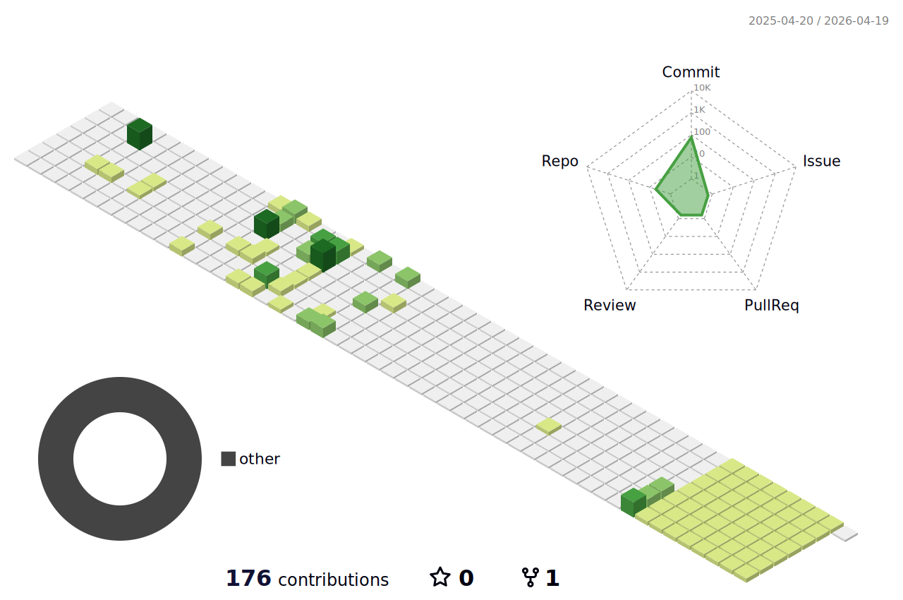

<h1 align="center">Hi 👋, I'm YOUR_NAME</h1>
<h3 align="center">Frontend Developer • AI Enthusiast • Problem Solver</h3>

  I build modern web applications with React & Next.js and explore AI systems with Python.
   
  Focused on writing clean, scalable and production-ready code.

---

## 🧠 About Me

- 🚀 Frontend developer specialized in **React & Next.js**
- 🤖 Exploring **Machine Learning & AI systems**
- 🧩 Strong interest in clean architecture & performance optimization
- 📚 Currently learning deeper concepts in **Deep Learning & System Design**
- 💡 I enjoy building real-world projects, not just tutorials

---

## ⚡ Tech Stack

### 💻 Frontend

### 🛠 Backend

### 🤖 AI / Data

---

## 📊 GitHub Stats

  
  

---

## 🔥 GitHub Streak

  

---

## 📈 Activity Graph

  

---

## 🚀 Featured Projects

### 🧠 AI Brain Tumor Detection
Deep learning model using CNN for MRI image classification  
Built with Python & integrated with Next.js frontend  

### 🌐 Modern Full-Stack Web App
Production-ready web application with:
- Next.js
- Node.js backend
- MongoDB database
- Secure authentication

---

## 🎯 Current Goals

- 📌 Master advanced React patterns
- 📌 Improve ML mathematical foundations
- 📌 Contribute to open-source projects
- 📌 Build scalable SaaS products

---

## 📫 Connect With Me

---

  ⚡ "Consistency beats intensity."

## Hi there 👋

### My 3D Contributions

